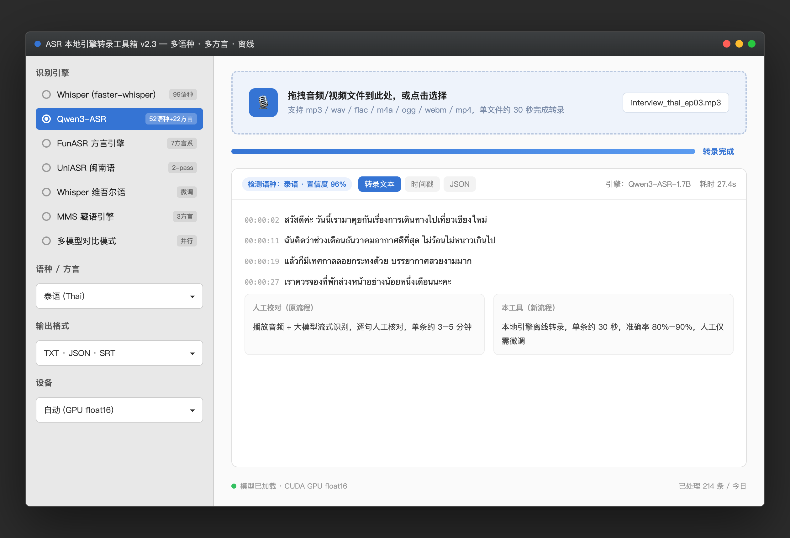
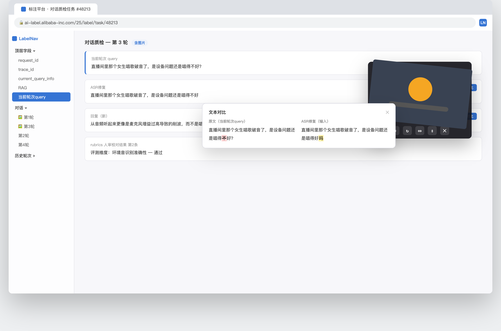
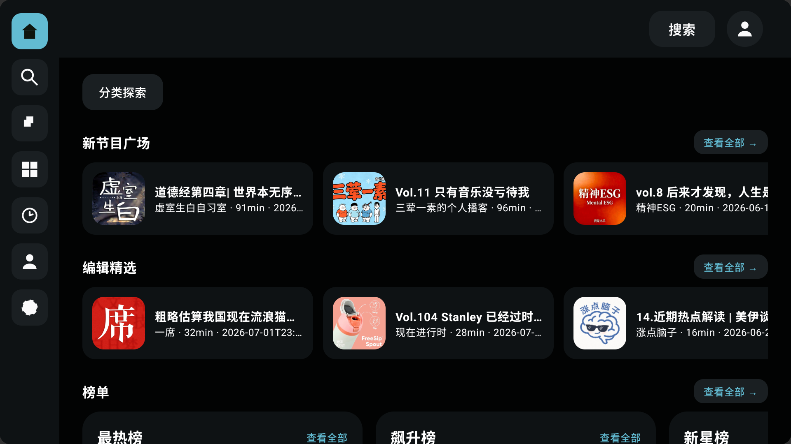
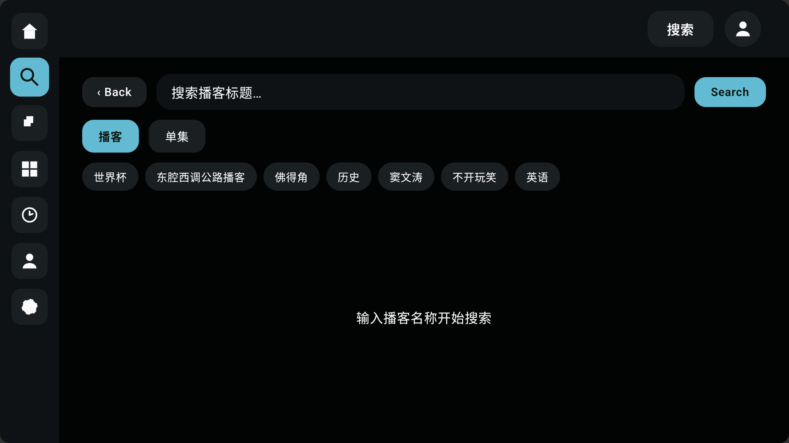
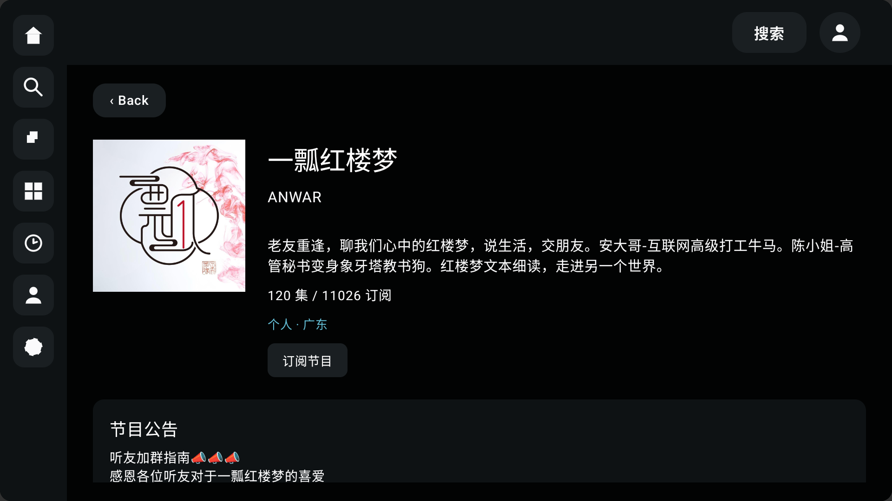
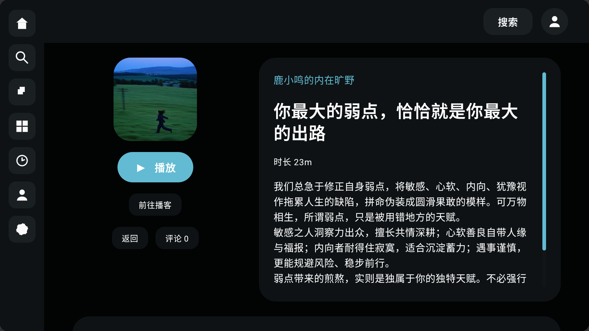
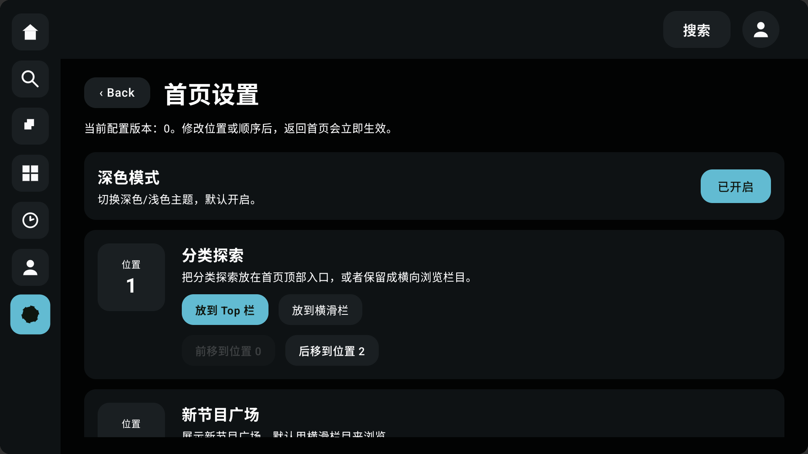

# 王梓琦｜个人能力与项目作品

> 求职方向：Live 音视频、对话场景设计、AI 数据构造与质量评测

## 个人简介

拥有两年内容运营经验，并长期在业余时间使用 AI 独立开发效率工具。我既能理解一个内容或对话场景应该如何设计，也能通过工具将重复劳动转化为更高效、可复用的工作流程。

目前的能力主要集中在以下四个方面：

- AI 工具设计与独立开发
- 内容运营与标签体系建设
- 对话场景设计与数据构造
- 多模态数据质检与问题归因

---

## 一、独立开发工具，提升协作效率

我擅长发现实际工作流程中的效率痛点，并主动设计、开发工具解决问题。

### 1. 多语种录音转文字工具

#### 项目背景

日常工作中经常需要核对不同语种的录音内容，传统的“播放音频、逐句听写、人工核对”流程耗时较长。为此，我独立开发了一款带图形界面的本地转录工具，支持泰语、日语、韩语、维吾尔语、西班牙语等多种语言。

#### 项目成果

- 单条录音约半分钟即可完成转录
- 转录准确率约为 80%—90%，人工微调后即可使用
- 相比逐句听写和核对，显著提高了处理效率
- 支持全程本地离线运行，避免音频数据上传网络

#### 工具界面

---

### 2. 标注平台辅助插件

#### 项目背景

针对标注平台使用过程中内容查找繁琐、修改前后差异难以辨认、图片查看不便等问题，我开发了一款浏览器辅助插件，以减少重复操作并提升标注和质检效率。

#### 核心功能

- 提供侧边导航，可直接跳转到对应内容，无需反复滚动查找
- 自动标出修改前后的文本差异，快速定位改动位置
- 支持图片浮层查看，并可进行拖动、旋转和缩放

#### 插件界面

---

### 3. 播客类电视端 App

工作之外，我持续进行独立产品开发。曾独立完成一款播客类电视端 App，从产品设计、信息架构到功能开发均由我负责。

#### 项目内容

- 独立设计首页、分类浏览、单集播放、播客详情和订阅列表等信息架构
- 针对电视大屏和遥控器操作场景设计页面布局与浏览路径
- 后台支持可视化调整首页内容排布，修改后可即时生效

#### 产品界面

**首页**

**单集播放页**

**播客信息页**

**播客详情页**

**后台设置页**

除上述项目外，我还尝试开发过自媒体视频自动化生产工具，持续探索如何通过 AI 简化内容生产流程。

---

## 二、内容运营与场景设计能力

我拥有两年内容运营经验，擅长将复杂的内容场景拆解为清晰的分类、标签和执行标准。

曾在网易云音乐负责内容运营，长期覆盖以下垂类内容：

- 二次元
- 游戏音乐
- 日系音乐
- 摇滚
- 粤语音乐

在此期间，我参与过标签体系搭建，积累了内容分类、用户兴趣理解和内容供给组织方面的经验。

此后，我从事多模态数据质检工作，进一步积累了对语音场景的判断经验，包括：

- 说话人的情绪与语气是否自然
- 环境声音与当前场景是否匹配
- 上下文表达是否连贯
- 模型是否准确理解用户意图
- AI 生成内容的问题类型及其可能原因

---

## 三、重点关注的对话数据方向

结合内容运营与多模态质检经验，我希望重点参与以下几类对话数据的设计和构造。

### 1. 二次元与游戏对话

这类场景通常具有专有名词多、社区梗密集、用户追问频繁等特点，适合用于检验模型对垂直内容的理解深度，以及在多轮对话中的稳定性。

### 2. 兴趣陪伴类对话

结合以往理解用户兴趣、组织内容供给的经验，构造“用户表达兴趣，模型能够理解、承接并自然延展话题”的对话数据。

### 3. 语音情绪表达

关注模型在语音输出中能否恰当地传递情绪和语气，例如安慰、调侃、惊喜等场景下，声音表现是否自然、是否符合上下文。这也是 Live 语音交互中影响用户体验的重要因素。

我希望将这些内容构造经验进一步沉淀为可复用的场景库、判断标准和执行规范，而不仅是完成单次数据生产。

---

## 四、未来希望深入参与的方向

### 1. 对话场景体系建设

围绕二次元、游戏和兴趣陪伴等常见对话场景进行内容设计，并将实践经验整理为可重复使用的场景模板和执行标准。

### 2. AI 产出问题的界定与归因

判断 AI 输出存在的问题属于哪种类型，分析可能原因，并将反馈整理为算法团队可以直接使用的信息，为模型优化提供支持。

### 3. 语音难点场景的处理与评测

重点关注方言、口音、多语种和嘈杂环境等常见语音理解难点，将多语种转录工具开发过程中积累的经验应用于语音数据处理与模型评测。

---

## 能力概览

| 能力方向 | 相关经验 |
| --- | --- |
| 工具开发 | 多语种转录工具、标注平台辅助插件、播客电视端 App |
| 内容运营 | 两年音乐内容运营经验，覆盖多个垂直内容领域 |
| 标签体系 | 参与内容标签体系搭建，能够拆解分类与执行标准 |
| 对话设计 | 二次元、游戏、兴趣陪伴等垂直对话场景 |
| 多模态质检 | 语音情绪、环境声音、上下文连贯性与问题归因 |
| 语音处理 | 多语种、方言、口音及嘈杂环境下的语音理解 |
